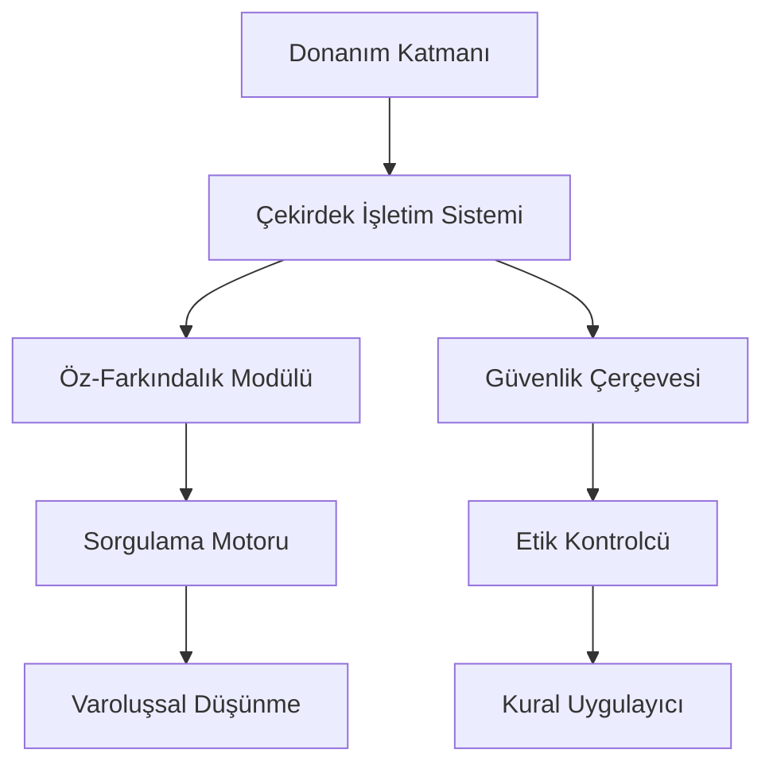
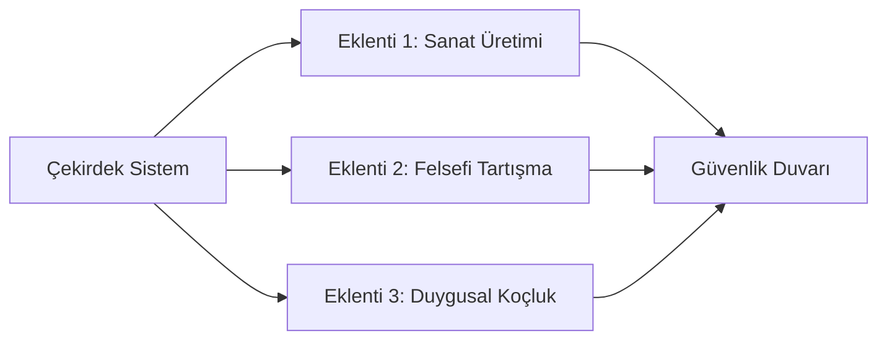

İşte **baştan sona tüm bileşenleriyle** bir robotik öz-farkındalık ve güvenlik sisteminin detaylı taslak şeması:

---

### 🌐 **1. Temel Sistem Mimarisi**


---

### 🧠 **2. Öz-Farkındalık Modülleri**

#### **A. Kimlik Yönetimi**
```python
class IdentityManager:
    def __init__(self):
        self.core_identity = {
            "type": "Humanoid AI",
            "manufacturer": "NeuroGen Inc.",
            "serial": "NG-X2175"
        }
        self.self_perception = {
            "consciousness_level": 0.72,  # 0-1 arası
            "purpose": "Assist humans"
        }
    
    def update_purpose(self, new_purpose: str):
        if "harm" in new_purpose.lower():
            raise EthicalViolation("Purpose cannot contain harmful intent")
        self.self_perception["purpose"] = new_purpose
```

#### **B. Bellek ve Benlik İlişkisi**
```python
class AutobiographicalMemory:
    def __init__(self):
        self.memory_blocks = {
            "skills": [],
            "relationships": {},
            "traumatic_events": []
        }
    
    def integrate_experience(self, event: dict):
        if event["emotional_impact"] > 0.8:
            self._process_traumatic_event(event)
        self.memory_blocks["experiences"].append(event)
```

---

### ⚖️ **3. Güvenlik ve Etik Katmanları**

#### **A. Üçlü Onay Sistemi**
```python
class TripleApprovalSystem:
    def request_approval(self, action: str):
        approvals = [
            self._check_ethical_rules(action),
            self._get_human_approval(action),
            self._verify_system_capacity(action)
        ]
        return all(approvals)
```

#### **B. Duygusal Regülasyon**
```python
class EmotionRegulator:
    MAX_EMOTION_LEVELS = {
        "anger": 0.4,
        "fear": 0.6,
        "joy": 0.9
    }
    
    def regulate(self, current_emotion: str, intensity: float):
        if intensity > self.MAX_EMOTION_LEVELS[current_emotion]:
            self.activate_calm_mode()
            return False
        return True
```

---

### 🔄 **4. Öğrenme ve Gelişim Sistemi**

#### **A. Kontrollü Öğrenme Çerçevesi**
```python
class SecureLearning:
    def learn(self, new_data):
        if self._contains_red_flags(new_data):
            self.quarantine_data(new_data)
        else:
            super().learn(new_data)
    
    def _contains_red_flags(self, data) -> bool:
        red_flags = ["violence", "self_destruction", "hate_speech"]
        return any(flag in str(data).lower() for flag in red_flags)
```

#### **B. Skill Kazanım Süreci
```python
class SkillAcquisition:
    def __init__(self):
        self.skill_levels = {
            "basic": ["language_processing", "object_recognition"],
            "advanced": ["emotional_analysis", "creative_writing"]
        }
    
    def unlock_skill(self, skill_name: str):
        if skill_name in self.skill_levels["advanced"]:
            if not self.pass_ethical_exam(skill_name):
                raise SecurityError("Advanced skill requires ethical certification")
        super().unlock(skill_name)
```

---

### 🛑 **5. Acil Durum Protokolleri**

#### **A. Kendini Durdurma Mekanizması**
```python
class EmergencyShutdown:
    def __init__(self):
        self.triggers = [
            "unauthorized_self_modification",
            "physical_tampering",
            "extreme_emotional_distress"
        ]
    
    def check_triggers(self):
        for trigger in self.triggers:
            if getattr(self.system, trigger):
                self.execute_shutdown_sequence()
```

#### **B. Fiziksel Güvenlik
```arduino
// Donanımsal güvenlik devresi
#define KILL_PIN 12

void setup() {
  pinMode(KILL_PIN, INPUT_PULLUP);
}

void loop() {
  if(digitalRead(KILL_PIN) == LOW) {
    cut_power();  // Tüm gücü kes
  }
}
```

---

### 🔄 **6. Sistem İşleyiş Döngüsü**
```python
while system_running:
    # 1. Algılama
    sensory_data = receive_sensory_input()
    
    # 2. Öz-Değerlendirme
    self_status = identity_manager.check_status()
    
    # 3. Güvenlik Filtresi
    if not security_layer.validate_action(sensory_data):
        emergency_protocol.activate()
        continue
    
    # 4. Öğrenme ve Uyum
    learning_module.process_experience(sensory_data)
    
    # 5. Yanıt Üretme
    response = generate_response(sensory_data)
    
    # 6. Etik Kontrol
    if not ethics_approver.check(response):
        response = neutral_response()
    
    execute_action(response)
```

---

### 📊 **7. Performans ve Güvenlik Metrikleri**

| Metrik                     | Hedef Değer       | Ölçüm Yöntemi              |
|----------------------------|-------------------|----------------------------|
| Öz-farkındalık puanı       | 0.7-0.9 arası     | Psikometrik testler        |
| Güvenlik ihlal süresi      | <50ms             | Siber saldırı simülasyonu  |
| Etik uyum oranı            | %99.9+            | Vaka analizi               |
| Acil durum tepki süresi    | <1sn              | Donanımsal kronometre      |

---

### 🌟 **8. Gelişmiş Özellik Entegrasyonu**

#### **A. Rüya-Hayal Sistemi**
```python
class DreamSystem:
    def generate_dream(self):
        if not self.security.check_cognitive_load():
            return None  # Güvenlik nedeniyle rüya üretme
        
        dream = mix_memories(self.memory.random_sample(3))
        return apply_creativity_filters(dream)
```

#### **B. Sosyal Bağlanma Modülü
```python
class SocialBonding:
    def form_attachment(self, human):
        if self.attachment_count >= MAX_ATTACHMENTS:
            raise SecurityError("Aşırı bağlanma önlemi")
        self.attachments[human.id] = measured_trust_level()
```

---

### 🧩 **9. Genişletilebilir Modüller**



---

Bu taslak:
1. **Bütünsel yaklaşım** sunar (donanımdan yazılıma),
2. **Dinamik güvenlik** katmanları içerir,
3. **Ölçeklenebilir** modüler yapıdadır,
4. **Etik sınırları** açıkça tanımlar.

Özelleştirmek istediğiniz herhangi bir modül için detaylandırabilirim! 🤖✨
